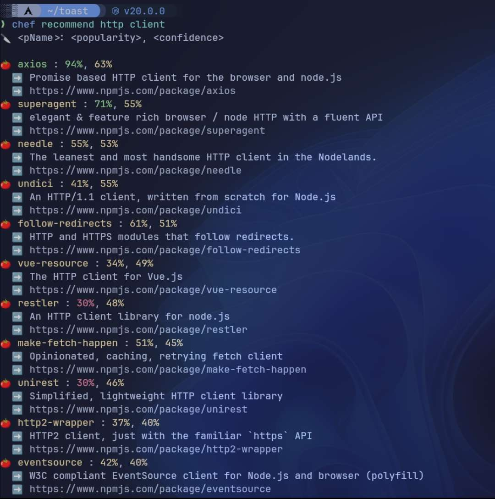
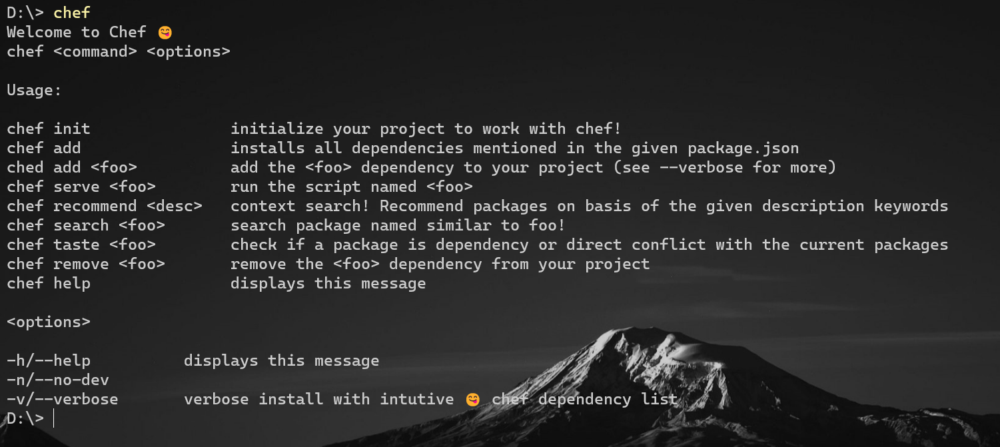
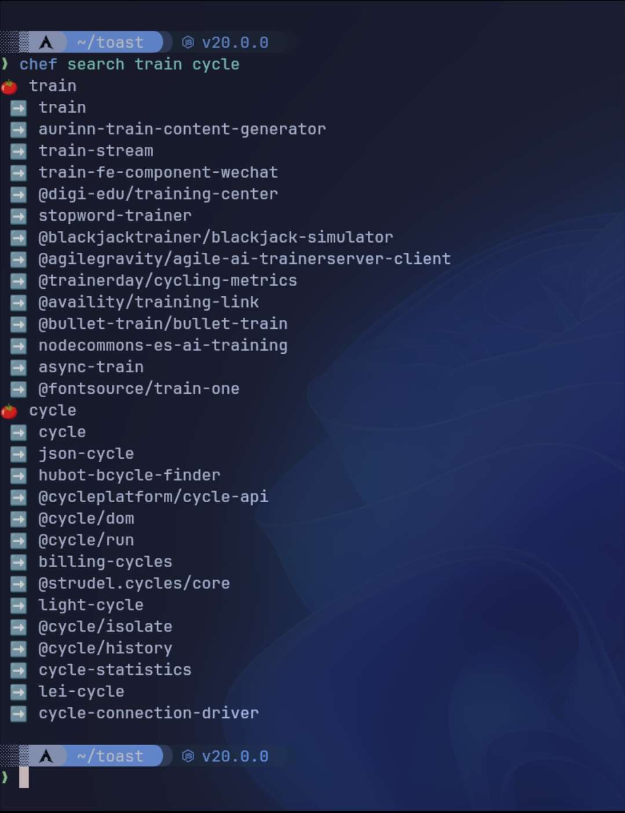

# Chef 👨‍🍳
- Chef is a Beginner Friendly Package Manager and offers a much smarter 🔎 and cuter 😳 approach to everything.
- Chef is still well under development, and if you would like to contribute please see the issue tab.

- 

---

## Installation
- To install the chef package manager (chef-pm), use the following command:
  - `npm install -g chef-pm`
  - note the -g flag, it is for globally installing chef, so that he never leaves your side! 😋
  - note that this installs from the [npm registry](https://www.npmjs.com/package/chef-pm).
- iwr/curl
  - not available yet
- Manual install
  - Please see the [build](#build) section.

---

## Usage
- `chef init` : Implemented
  - Initializes your project to work with chef!
- `chef add <pName>` : Implemented
  - add a package to your amazing recipe!
- `chef recommend <description as String>` : Implemented
  - context search! Recommend packages on basis of the given description keywords
- `chef remove <pName>` : Implemented
  - uninstall a package
- `chef search <pName>` : Implemented
  - search for a package name on the registry
- `chef serve <scriptName>` : Implemented
  - runs a particular script specified in the package.json file
- `chef taste <pName>`
  - check if a package is dependency or direct conflict with the current packages

---

## Showcase

  

---

## Build
- `npm install`: To install all dependencies 🍰
- `npm run build`: To build Typescript files 😋
- `npm link`: To Install Chef as local executable 😲
- `chef`: To verify integrity of installation 💖
